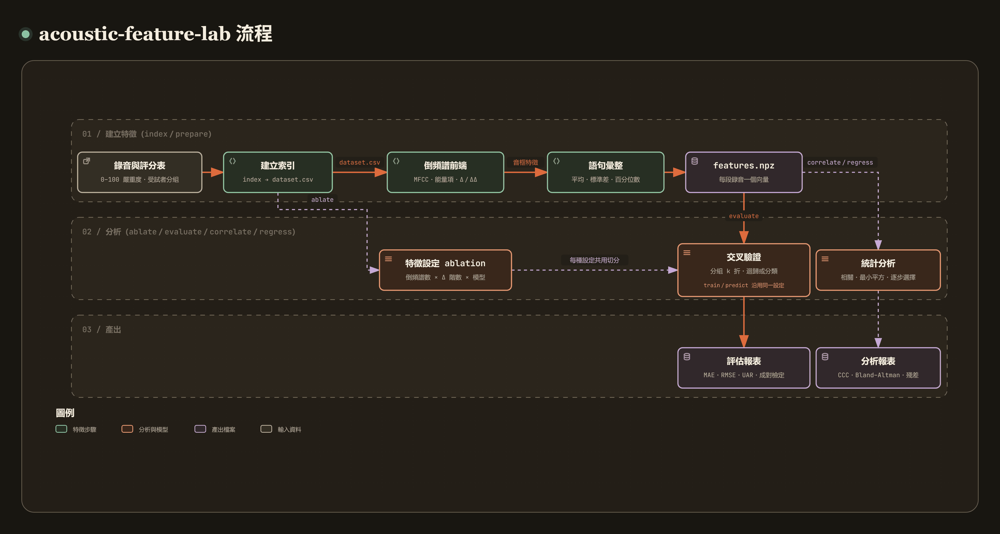

# acoustic-feature-lab

[](https://github.com/recklight/acoustic-feature-lab/actions/workflows/ci.yml)
[](https://www.python.org/downloads/)
[](LICENSE)

以梅爾頻率倒頻譜係數（Mel-Frequency Cepstral Coefficients, MFCC）描述嗓音，比較不同的特徵設定，並以迴歸模型預測連續的臨床嚴重度評分。

輸入是持續母音的錄音，以及每段錄音的嚴重度評分（例如 CAPE-V 的 0–100 視覺類比量尺）。倒頻譜前端先算出音框（frame）層級的特徵，再彙整成每段錄音一個向量，接著用依受試者分組的交叉驗證評估迴歸或分類模型。同一套流程可以展開「倒頻譜數 × Δ 階數 × 能量項 × 彙整統計量 × 模型」的 ablation 網格並做顯著性比較；迴歸分析的部分有最小平方推論、殘差診斷、逐步選擇與多項式階數選擇，也能算特徵與評分之間的相關與一致性。結果寫成 CSV、JSON 與圖檔，每個輸出資料夾都留有當次的設定檔與 manifest，之後可以照著重跑。Python 套件名稱是 `acoustic_feature_lab`，命令列工具是 `acoustic-feature-lab`。

作者：RL

---

## 目錄

- [專案簡介](#專案簡介)
- [方法說明](#方法說明)
- [安裝步驟](#安裝步驟)
- [快速開始](#快速開始)
- [使用範例](#使用範例)
- [CLI 指令對照表](#cli-指令對照表)
- [專案結構](#專案結構)
- [資料準備](#資料準備)
- [設定檔](#設定檔)
- [結果與評估指標](#結果與評估指標)
- [已知限制](#已知限制)
- [設計重點](#設計重點)
- [開發與測試](#開發與測試)
- [References](#references)
- [License](#license)

---

## 專案簡介

[](https://raw.githack.com/recklight/acoustic-feature-lab/master/docs/workflow.html?theme=dark)

互動版流程圖可以縮放、搜尋節點，也能標出任兩個步驟之間的路徑：[線上瀏覽](https://raw.githack.com/recklight/acoustic-feature-lab/master/docs/workflow.html?theme=dark)，或用瀏覽器開啟本機的 [`docs/workflow.html`](docs/workflow.html)。

臨床嗓音評估常以聽覺量表打分數：GRBAS 的 G 分數是 0–3 的序位等級（Hirano, 1981），CAPE-V 則在 0–100 的量尺上標記整體嚴重度（Kempster et al., 2009）。用聲學特徵預測這類連續分數是常見的研究題目（例如 Maryn et al., 2010 結合多個聲學指標的模型），但光是 MFCC 就有一串會改變結果的細節：框長與位移、濾波器數量與頻率下限、倒頻譜係數個數、用 `c0` 還是對數能量、要不要加 Δ 與 ΔΔ（也就是 13、26 或 39 維），以及音框怎麼彙整成一個語句向量。RMSE 差了一兩分，是設定造成的還是交叉驗證本身的波動，只看一次切分分不出來。

所以這裡每個選擇都是設定檔裡的一個鍵，所有設定組合都在同一組依受試者分組的切分上評估，比較時用考慮訓練集重疊的修正 t 檢定，再以 Holm 法校正多重比較；迴歸分析除了樣本內的 $R^2$，也輸出殘差診斷與樣本外的誤差。預強調、分框、梅爾濾波器組、Δ 迴歸、HTK 檔案讀寫、端點偵測與 UAR 這些共用元件來自 [`speechdsp`](https://pypi.org/project/speechdsp/)。

| 階段 | 做什麼 | 對應模組 |
| --- | --- | --- |
| 1. 讀取錄音 | 單聲道 float64、可重新取樣、以秒為單位修剪頭尾、可選端點偵測 | `corpus` |
| 2. 倒頻譜前端 | 預強調、對稱 Hamming 窗、梅爾濾波器組、HTK 縮放 DCT、倒頻譜提升、能量項、Δ／ΔΔ | `cepstral_frontend` |
| 3. 語句彙整 | 平均、標準差、極值、百分位數、偏態、峰態，可先做 CMN／CMVN | `pooling` |
| 4. 資料集與特徵檔 | `dataset.csv` 索引、`features.npz`、從評分表建立索引 | `dataset`、`pipeline` |
| 5. 模型 | 迴歸與分類估計器、PCA／LDA、巢狀交叉驗證調參、模型檔 | `models`、`neural` |
| 6. 評估 | 分組或分層 k 折、迴歸與分類指標 | `splitting`、`evaluation` |
| 7. Ablation | 展開特徵設定網格、共用切分、成對顯著性檢定 | `ablation` |
| 8. 迴歸分析 | 最小平方推論、殘差診斷、逐步選擇、多項式階數、梯度下降 | `ols`、`regression_diagnostics`、`stepwise`、`design_matrix`、`polynomial_order`、`gradient_descent` |
| 9. 相關與一致性 | Pearson（Fisher z 區間）、Spearman、Lin's CCC、Bland–Altman | `association` |
| 10. 輸出 | 圖與同內容的 CSV、`config.yaml`、`manifest.json` | `figures`、`manifest` |
| 11. 合成資料 | 嚴重度可控的合成持續母音與迴歸練習資料，供測試、範例與快速開始使用 | `synthetic` |

---

## 方法說明

### 1. 倒頻譜前端（MFCC）

整段訊號先經過預強調 $y[n] = x[n] - a\,x[n-1]$（第一個樣本原樣保留），再以 `frame_ms`／`hop_ms` 分框；毫秒依**每個檔案實際的取樣率**換算成樣本數（無條件捨去，所以 44.1 kHz 下 30／15 ms 是 1323／661 點，16 kHz 下是 480／240 點）。每框乘上分析窗後做 `n_fft` 點 FFT，功率譜 $|X_k|^2$ 乘上 `n_mels` 個峰值為 1 的三角濾波器；濾波器邊界在梅爾刻度 $m(f) = 1127 \ln(1 + f/700)$ 上等距（Stevens et al., 1937；O'Shaughnessy, 1987），從 `fmin_hz` 到 `fmax_hz`。濾波器能量取自然對數前先套用下限 `log_floor`，所以全零的框也不會產生 $-\infty$。接著以 HTK 慣例的 DCT-II 取倒頻譜（Davis & Mermelstein, 1980；Young et al., 2006）：

$$c_m = \sqrt{\frac{2}{N}} \sum_{n=1}^{N} \log E_n \cos\left(\frac{\pi m (n - 0.5)}{N}\right), \qquad m = 0, \dots, M$$

這個縮放對 $m \ge 1$ 與 SciPy 的正交 DCT 相同，$c_0$ 則大 $\sqrt 2$ 倍（doctest 會驗證這個關係）。$c_1 \dots c_M$ 再乘上正弦提升 $1 + \tfrac{L}{2}\sin(\pi m / L)$（Juang et al., 1987）。能量項依 HTK 的排列放在倒頻譜之後：`c0`、原始框的對數能量 `log_e`（和 ETSI 前端的 logE、HTK 預設的 raw energy 一樣，在預強調與加窗之前計算），或不加。

預設值沿用分散式語音辨識前端（ETSI ES 201 108）的濾波器組：64 Hz 到 Nyquist 頻率之間 23 個濾波器、預強調 0.97、對稱 Hamming 窗、12 個倒頻譜係數加 `c0`；但它**不是**該標準的完整重現：框長與位移是 30／15 ms（標準為 25／10 ms），濾波器作用在功率譜而非振幅譜，倒頻譜採 HTK 縮放並經過提升。

`speechdsp` 的 `mfcc()` 是一組固定的配方（週期 Hamming 窗、濾波器從 0 Hz 起、正交 DCT、第 0 維放對數能量而不是 `c0`），偏偏這些選擇就是這裡要比較的對象，所以前端只拿 `speechdsp` 的預強調、分框、梅爾濾波器組與 Δ 當元件，窗函數、功率譜、DCT 縮放與能量項的組合由專案自己處理。把設定調成與 `speechdsp.mfcc()` 相同時，兩者算出的 $c_1 \dots c_{12}$ 逐值一致（`tests/test_cepstral_frontend.py` 驗證）。

| 設定鍵 | 預設 | 作用 |
| --- | --- | --- |
| `frontend.frame_ms` / `frontend.hop_ms` | 30.0 / 15.0 | 框長與位移（毫秒），依實際取樣率換算 |
| `frontend.n_fft` | `null` | FFT 點數；`null` 取能容納一框的最小 2 的冪次 |
| `frontend.window` | `hamming_symmetric` | 對稱 Hamming、週期 Hamming、Hann 或矩形窗 |
| `frontend.preemphasis` | 0.97 | 預強調係數，0 表示不做 |
| `frontend.n_mels` | 23 | 三角濾波器個數 |
| `frontend.fmin_hz` / `frontend.fmax_hz` | 64.0 / `null` | 濾波器組頻率範圍；`null` 為 Nyquist 頻率 |
| `frontend.n_ceps` | 12 | 倒頻譜係數 $c_1 \dots c_M$ 的個數（不含 $c_0$） |
| `frontend.energy_term` | `c0` | `c0`、`log_energy` 或 `none` |
| `frontend.lifter` | 22 | 正弦提升長度 $L$，0 表示不提升 |
| `frontend.log_floor` | 1e-10 | 取對數前的能量下限 |

### 2. 動態特徵與 13／26／39 維版面

Δ 以迴歸係數計算（Furui, 1986），邊界以複製頭尾框的方式處理：

$$d_t = \frac{\sum_{n=1}^{N} n\,(c_{t+n} - c_{t-n})}{2 \sum_{n=1}^{N} n^2}$$

Δ 使用 $N = 3$（7 框窗），ΔΔ 是對 Δ 再取一次、$N = 2$（5 框窗）。`delta_order` 為 0、1、2 時，每框分別是 13、26、39 維，排列為 `[static | Δ | ΔΔ]`；`feature_layout()` 會產生 `c1 … c12, c0, d_c1 …, dd_c0` 這樣的欄名，讓每個結果都能追溯到哪一欄特徵。

| 設定鍵 | 預設 | 作用 |
| --- | --- | --- |
| `frontend.delta_order` | 2 | 0 只用靜態特徵、1 加 Δ、2 加 Δ 與 ΔΔ |
| `frontend.delta_widths` | `[7, 5]` | Δ 與 ΔΔ 的迴歸窗長（奇數） |

### 3. 語句層級彙整

迴歸模型需要每段錄音一個向量，所以把該錄音所有框的每一欄做統計：平均、標準差、最小值、最大值、百分位數、偏態與超額峰態（後兩者是有偏的動差比，常數欄位定義為 0）。輸出以統計量為主序排列，欄名像 `mean_c1`、`std_d_c0`、`p90_c12`。彙整前可以先對每段錄音做倒頻譜平均正規化（CMN）或平均變異數正規化（CMVN）；會讓統計量對所有錄音都相同的組合（CMN 後取平均、CMVN 後取平均或標準差）會直接報錯，免得產生一整欄常數。

| 設定鍵 | 預設 | 作用 |
| --- | --- | --- |
| `pooling.statistics` | `[mean, std]` | 依序輸出的統計量 |
| `pooling.percentiles` | `[10.0, 50.0, 90.0]` | `percentile` 使用的百分位 |
| `pooling.normalization` | `none` | `none`、`cmn` 或 `cmvn` |

### 4. 迴歸與分類模型

每個模型都是 scikit-learn 的 `Pipeline`（Pedregosa et al., 2011）：`StandardScaler` → 降維（無、PCA，或分類任務的 LDA）→ 估計器，因此標準化與降維只在訓練折上學習。迴歸可選最小平方、Ridge（Hoerl & Kennard, 1970）、支援向量迴歸（Drucker et al., 1997）、隨機森林（Breiman, 2001）與多層感知器；分類可選 Logistic 迴歸、支援向量分類器、隨機森林與多層感知器。感知器隱藏層的活化函數由 `model.activation` 決定，迴歸與分類都預設 logistic。scikit-learn 的感知器依 Glorot & Bengio（2010）的正規化初始化設定權重（範圍 $\pm\sqrt{6/(n_{in}+n_{out})}$，logistic 活化時把 6 換成 2）；另有放在 `dl` extra 的 PyTorch 感知器（Adam 最佳化，Kingma & Ba, 2015），權重沿用 PyTorch 預設的 $\pm 1/\sqrt{n_{in}}$ 均勻初始化，也就是 Glorot & Bengio 式 (1) 的常用作法，在 CPU 上訓練。SVR 與迴歸感知器預測的是標準化後的目標，所以 `svr_epsilon` 的單位是評分的標準差。LDA 最多只有 $C - 1$ 個判別方向（Fisher, 1936），要求更多會直接報錯。`model.tune` 開啟時，每個訓練折會再做一次內層交叉驗證，從小網格中挑超參數後重新擬合，外層折因此評估的是「含調參的整個流程」（Varma & Simon, 2006）。

| 設定鍵 | 預設 | 作用 |
| --- | --- | --- |
| `data.task` | `regression` | `regression` 或 `classification` |
| `data.target` | `severity` | `dataset.csv` 中的目標欄位 |
| `model.name` | `ridge` | 迴歸：`linear`、`ridge`、`svr`、`random_forest`、`mlp`、`torch_mlp`；分類：`logistic`、`svc`、`random_forest`、`mlp`、`torch_mlp` |
| `model.reducer` / `model.n_components` | `none` / `null` | 降維方式與維度；`null` 為 PCA 保留 95 % 變異或 LDA 取 $C-1$ |
| `model.tune` | `false` | 巢狀交叉驗證調參 |
| `model.ridge_alpha`、`model.svr_c`、`model.svr_epsilon` | 1.0、1.0、0.1 | 迴歸超參數 |
| `model.hidden_units`、`model.activation`、`model.mlp_alpha` | `[100]`、`logistic`、1e-4 | 感知器結構與 L2 懲罰 |
| `model.early_stopping` / `model.patience` | `false` / 50 | 只用於 scikit-learn 感知器：是否以訓練折內 10 % 的驗證集提前停止；`patience` 是容許沒有進步的 epoch 數，關閉提前停止時看的是訓練損失 |

內層調參的網格：Ridge 的 `alpha` ∈ {0.01, 0.1, 1, 10, 100}；SVR 的 `C` ∈ {0.1, 1, 10} × `epsilon` ∈ {0.05, 0.1, 0.5}；隨機森林的 `max_depth` ∈ {無限制, 4, 8} × `min_samples_leaf` ∈ {1, 3}；感知器的 `alpha` ∈ {1e-4, 1e-2, 1}；Logistic 的 `C` ∈ {0.01, 0.1, 1, 10}；SVC 的 `C` ∈ {0.1, 1, 10}。迴歸以 RMSE、分類以 UAR 選擇。

### 5. 交叉驗證與評估指標

外層評估與內層調參都用 k 折交叉驗證（Stone, 1974）。分類使用分層 k 折，資料集有 `group` 欄（受試者）時則用分層分組 k 折；迴歸使用打亂的 k 折，有分組時依 `GroupKFold` 的規則，由大到小把每位受試者的錄音整組放進目前錄音最少的一折。大小相同的組誰先放由種子決定，而不是交給排序演算法：NumPy 各版本的 `argsort` 對相同值的排列不一樣，交給它的話，同一個種子在不同環境會切出不同的折。同一位受試者的錄音永遠在同一折，避免模型「認得受試者」造成的樂觀偏差；以錄音而不是受試者切分，會高估對新受試者的表現（Saeb et al., 2017）。

迴歸指標為 MAE、RMSE、$R^2$、Pearson $r$、Spearman $\rho$ 與 Lin 的一致性相關係數（CCC）；分類指標為未加權平均召回率（UAR，Schuller et al., 2009）、準確率、macro F1，二類問題再加敏感度、特異度與 ROC-AUC，`evaluation.positive_class` 指定哪一類是陽性。每個指標都報告各折的值、各折平均與樣本標準差（`ddof=1`），以及把所有 out-of-fold 預測合併後計算的 pooled 值。

| 設定鍵 | 預設 | 作用 |
| --- | --- | --- |
| `evaluation.n_splits` | 5 | 外層折數 |
| `evaluation.n_inner_splits` | 3 | 內層調參折數 |
| `evaluation.positive_class` | `dysphonic` | 二類問題的陽性類別 |
| `seed` | 0 | 切分、模型初始化與合成資料的主種子 |

### 6. 特徵設定的 ablation 與顯著性檢定

`ablation` 區段的每個清單是網格的一個維度：`n_ceps`、`n_mels`、`delta_order`、`energy_term`、`frame_hop_ms`、`lifter`、`statistics`、`reducer`、`models`；空清單表示沿用 `frontend`／`pooling`／`model` 的值。網格展開成所有組合，**每個清單的第一個值組成基準設定**。每個組合都以 `evaluation.n_splits` 折重複 `ablation.n_repeats` 次評估，而切分只取決於目標、群組與種子，所以所有設定都用**完全相同**的折，分數可以成對比較。靜態倒頻譜依前端設定（不含 Δ 設定）只計算一次，再依各組合補上 Δ；`--cache-dir` 可把它們存到磁碟供下次使用。網格與其他區段是否相容（例如 `ablation.models` 是否符合 `data.task`、最多的倒頻譜數是否少於最少的濾波器數）在 `ablate` 展開網格時、開始計算之前檢查，所以為另一個任務或前端寫的網格不會擋住 `prepare`、`evaluate` 與 `train`。

設定 $s$ 與基準 $b$ 在 $J = k \times r$ 個折上的差 $d_j = \text{metric}_s - \text{metric}_b$，以 Nadeau–Bengio 修正的重抽樣 t 檢定比較（Nadeau & Bengio, 2003）：

$$t = \frac{\bar d}{\sqrt{\left(\frac{1}{J} + \frac{n_{test}}{n_{train}}\right) s_d^2}}, \qquad \text{df} = J - 1$$

修正項 $n_{test}/n_{train}$ 反映各折訓練集彼此重疊、分數並不獨立；忽略它的一般成對 t 檢定會嚴重高估顯著性。另附 Wilcoxon 符號等級檢定（Demšar, 2006）作為無母數的參考，兩組 p 值各自以 Holm 法（Holm, 1979）或 Benjamini–Hochberg 法（Benjamini & Hochberg, 1995）校正。

| 設定鍵 | 預設 | 作用 |
| --- | --- | --- |
| `ablation.n_ceps` | `[12, 6, 18]` | 要比較的倒頻譜數（第一個為基準） |
| `ablation.delta_order` | `[0, 1, 2]` | 13／26／39 維 |
| `ablation.models` | `[ridge, svr]` | 要比較的估計器 |
| `ablation.n_repeats` | 3 | k 折重複次數 |
| `ablation.metric` | `null` | 排名與檢定的指標；`null` 為 RMSE（迴歸）或 UAR（分類） |
| `analysis.correction` | `holm` | `holm` 或 `fdr_bh` |

### 7. 最小平方推論與殘差診斷

對設計矩陣 $X$（$n \times p$，含截距）以 QR 分解求 $\hat\beta = \arg\min \lVert y - X\beta \rVert^2$（Draper & Smith, 1998），並報告：

$$\hat\sigma^2 = \frac{\text{RSS}}{n-p}, \quad \text{SE}(\hat\beta_j) = \hat\sigma\sqrt{[(X^\top X)^{-1}]_{jj}}, \quad R^2 = 1 - \frac{\text{RSS}}{\text{TSS}}, \quad \bar R^2 = 1 - (1-R^2)\frac{n-1}{n-p}, \quad F = \frac{\text{ESS}/(p-1)}{\text{RSS}/(n-p)}$$

以及 $t$ 分布的信賴區間、高斯對數概似、AIC（Akaike, 1974）與 BIC（Schwarz, 1978）和設計矩陣的條件數。參數個數等於觀測數時殘差自由度為 0，模型只是內插資料：標準誤、檢定與 $R^2$ 一律輸出 NaN 並標記為「不可估計」；參數多於觀測或欄位線性相依時直接報錯。

殘差診斷包括 Shapiro–Wilk（Shapiro & Wilk, 1965）與 Jarque–Bera（Jarque & Bera, 1980）常態檢定、以 $nR^2$ 計算的 Breusch–Pagan 異質變異數檢定（Breusch & Pagan, 1979；Koenker, 1981）、Durbin–Watson 統計量（Durbin & Watson, 1950）、hat 矩陣對角線的 leverage、Cook's distance（Cook, 1977）$D_i = \frac{e_i^2}{p\hat\sigma^2}\frac{h_{ii}}{(1-h_{ii})^2}$，以及變異數膨脹因子 $\text{VIF}_j = 1/(1 - R_j^2)$（Marquardt, 1970）。二階反應曲面 $y = \beta_0 + \sum_i \beta_i x_i + \sum_i \beta_{ii} x_i^2 + \sum_{i<j} \beta_{ij} x_i x_j$（Box & Wilson, 1951）以中心化後的變數建構，避免 $x$ 與 $x^2$ 幾乎共線。

| 設定鍵 | 預設 | 作用 |
| --- | --- | --- |
| `analysis.ci_level` | 0.95 | 係數與相關係數信賴區間的水準 |

### 8. 逐步選擇、多項式階數與梯度下降

逐步選擇從空模型（或全模型）出發，每一步先嘗試加入偏 F 檢定 p 值最小且低於 `p_enter` 的變數，沒有可加入者才嘗試移除 p 值最大且高於 `p_remove` 的變數，兩者皆無時停止（Efroymson, 1960）；要求 `p_enter ≤ p_remove` 並記錄走過的模型，避免無限循環。每一步的動作、F、p、$R^2$ 與調整後 $R^2$ 都會寫出。被選出的模型應再看 VIF 並做樣本外驗證，因為選擇過程用過的 p 值不能再當成推論。

多項式階數掃描對每一階同時列出樣本內的 $R^2$、調整後 $R^2$、整體 F 檢定、SSE、AIC、BIC，以及樣本外的留一法 RMSE（以 PRESS 殘差 $e_i/(1-h_{ii})$ 的閉式解計算）與 k 折 RMSE（每個訓練折重新建立多項式基底）。預設使用以三項遞迴建立的離散正交多項式

$$p_{k+1}(x) = (x - a_k)\,p_k(x) - b_k\,p_{k-1}(x)$$

各欄彼此正交、條件數為 1；未中心化的 $x^6$（例如 $x \approx 2000$ 的年份）會讓設計矩陣在數值上奇異。

梯度下降以向量化的同步更新 $\theta \leftarrow \theta - \frac{\alpha}{m} Z^\top (Z\theta - y)$ 最小化 $J = \frac{1}{2m}\lVert Z\theta - y\rVert^2$（Cauchy, 1847），先將變數標準化再把係數換回原單位；以成本的相對下降量判斷收斂，同時設有迭代上限並偵測發散，結果與閉式最小平方解比對。

| 設定鍵 | 預設 | 作用 |
| --- | --- | --- |
| `analysis.p_enter` / `analysis.p_remove` | 0.05 / 0.10 | 逐步選擇的進入與移除門檻 |
| `analysis.stepwise_start` | `empty` | `empty`（向前）或 `full`（向後） |
| `analysis.max_degree` | 8 | 階數掃描的最高階 |
| `analysis.polynomial_basis` | `orthogonal` | `orthogonal`、`centered` 或 `raw` |
| `analysis.order_criterion` | `kfold_rmse` | 推薦階數的依據：`kfold_rmse`、`loocv_rmse`、`bic`、`aic` |

### 9. 相關與一致性分析

「特徵是否與評分一起變動」與「預測值是否**等於**臨床評分」是兩個不同的問題。前者對每一欄特徵計算 Pearson $r$ 與 Fisher $z$ 信賴區間 $\tanh(\operatorname{atanh} r \pm z_{1-\alpha/2}/\sqrt{n-3})$（Fisher, 1915），以及 Spearman 等級相關 $\rho$（Spearman, 1904），整組 p 值再做多重比較校正。後者使用 Lin 的一致性相關係數（Lin, 1989）

$$\rho_c = \frac{2 s_{xy}}{s_x^2 + s_y^2 + (\bar x - \bar y)^2}$$

它同時懲罰散布與系統性偏差（所有預測都高 10 分時 Pearson $r$ 仍為 1，但 $\rho_c$ 會下降），以及 Bland–Altman 分析的平均差與 95 % 一致性界限 $\bar d \pm 1.96\,s_d$（Bland & Altman, 1986）。`evaluate` 在迴歸任務中會自動輸出這兩項。

### 10. 合成資料

測試與範例全部使用程式產生的持續母音，生成方式是簡單的聲源–濾波器模型。聲源是 Rosenberg 聲門脈衝（Rosenberg, 1971），開啟相占週期 40 %、關閉相 16 %；每個週期的長度與振幅分別加上相對標準差為 jitter 與 shimmer 的高斯擾動。聲道是三個串接的二階共振峰濾波器，母音 /a/、/i/、/u/ 的共振峰取 Peterson & Barney（1952）的男聲平均值，再以一階差分模擬唇端輻射。最後加上經同一聲道濾波的白雜訊，強度依諧波雜訊比（HNR）調整。

嚴重度 $s \in [0, 100]$ 讓 jitter、shimmer 與 HNR 在 `synthetic.*_range` 的兩端之間線性變化。每位受試者有自己的平均音高與嚴重度，同一人的各段錄音在嚴重度、母音、音高與音量上都有變化，所以模型必須從干擾變因中找出嚴重度線索，而 `group` 欄讓交叉驗證能把受試者分開。嚴重度大於等於 `label_threshold` 的錄音標為 `dysphonic`，其餘為 `healthy`，供分類任務使用。另有三組迴歸練習資料：已知係數的二階反應曲面、三次多項式，以及四個加總接近 100 % 的混合比例（刻意製造多重共線性）。

| 設定鍵 | 預設 | 作用 |
| --- | --- | --- |
| `synthetic.n_speakers` / `synthetic.n_recordings_per_speaker` | 20 / 3 | 受試者數與每人錄音數 |
| `synthetic.duration_s` / `synthetic.sample_rate` | 1.0 / 16000 | 錄音長度與取樣率 |
| `synthetic.jitter_range` | `[0.002, 0.03]` | 嚴重度 0 與 100 時的週期擾動 |
| `synthetic.shimmer_range` | `[0.02, 0.3]` | 嚴重度 0 與 100 時的振幅擾動 |
| `synthetic.hnr_range_db` | `[30.0, 6.0]` | 嚴重度 0 與 100 時的諧波雜訊比 |
| `synthetic.label_threshold` | 35.0 | 分類標籤的門檻 |

---

## 安裝步驟

需要 Python 3.10 以上。

```bash
git clone https://github.com/recklight/acoustic-feature-lab.git
cd acoustic-feature-lab
python -m venv .venv
# Windows: .venv\Scripts\activate    Linux/macOS: source .venv/bin/activate
pip install -e .                 # 核心（會一併從 PyPI 安裝 speechdsp）
pip install -e ".[dl]"           # PyTorch 模型（選用）
pip install -e ".[dev]"          # 開發工具：pytest、ruff
```

沒有安裝 PyTorch 時，除了 `torch_mlp` 以外的所有功能都能使用；設定成 `torch_mlp` 卻沒有安裝時，錯誤訊息會提示在專案資料夾執行 `pip install -e ".[dl]"`。也可以不安裝，直接在專案資料夾內以 `PYTHONPATH=src python -m acoustic_feature_lab --help` 執行。

---

## 快速開始

不需要任何資料，以下指令會先產生合成資料集。

```bash
# 1. 產生合成資料集
acoustic-feature-lab synthesize --config configs/quick_demo.yaml --out data/synthetic
# 2. 由資料集索引準備模型輸入
acoustic-feature-lab prepare --config configs/quick_demo.yaml --out outputs/demo/prepare
# 3. 交叉驗證
acoustic-feature-lab evaluate outputs/demo/prepare/features.npz --config configs/quick_demo.yaml --out outputs/demo/evaluate
# 4. 以全部資料訓練
acoustic-feature-lab train outputs/demo/prepare/features.npz --config configs/quick_demo.yaml --out outputs/demo/train
# 5. 對新的輸入檔推論
acoustic-feature-lab predict data/synthetic/items/item_000.wav --model outputs/demo/train/model.joblib --out outputs/demo/predict
```

或一次跑完整個流程：`python examples/end_to_end_synthetic.py`。

> 這些指令跑出來的分數來自合成母音，只能確認流程跑得通；為什麼不能代表真實錄音，見[已知限制](#已知限制)第一點。

---

## 使用範例

### CLI

以自己的錄音與評分表進行研究的典型流程：

```bash
# 1. 由評分表建立資料集索引（ratings.csv 的欄位：id, severity, group）
acoustic-feature-lab index data/recordings --targets data/ratings.csv
# 2. 準備特徵：25 ms / 10 ms、26 個濾波器、對數能量（configs/compact_frontend.yaml）
acoustic-feature-lab prepare --config configs/compact_frontend.yaml --dataset data/recordings/dataset.csv --out outputs/study/prepare
# 3. 每一欄特徵與嚴重度的相關，Holm 校正
acoustic-feature-lab correlate outputs/study/prepare/features.npz --out outputs/study/correlate
# 4. 交叉驗證 SVR：以 --set 換模型並開啟巢狀調參，以 --seed 換切分
acoustic-feature-lab evaluate outputs/study/prepare/features.npz --config configs/compact_frontend.yaml --set model.name=svr --set model.tune=true --seed 7 --out outputs/study/evaluate_svr
# 5. 比較特徵設定：倒頻譜數 × 13／26／39 維 × 模型，靜態倒頻譜存入快取
acoustic-feature-lab ablate --config configs/compact_frontend.yaml --dataset data/recordings/dataset.csv --out outputs/study/ablate --cache-dir outputs/study/cache
# 6. 少數特徵的最小平方推論與殘差診斷
acoustic-feature-lab regress outputs/study/prepare/features.npz --predictors std_c8,mean_c10 --out outputs/study/regress
# 7. 以全部資料訓練，再推論新錄音
acoustic-feature-lab train outputs/study/prepare/features.npz --config configs/compact_frontend.yaml --out outputs/study/train
acoustic-feature-lab predict data/new/visit_01.wav data/new/visit_02.wav --model outputs/study/train/model.joblib --out outputs/study/predict
```

`regress`、`stepwise` 與 `order-sweep` 也接受一般的 CSV 表格，例如 `acoustic-feature-lab stepwise table.csv --target heat`、`acoustic-feature-lab order-sweep curve.csv --x year --target population`、`acoustic-feature-lab regress surface.csv --target y --design quadratic`。

### Python API

```python
import pandas as pd

from acoustic_feature_lab import (
    Config,
    FrontendConfig,
    cross_validate,
    feature_layout,
    frame_features,
    make_vowel,
    pool_frames,
    prepare_features,
    run_ablation,
    stepwise_select,
    write_synthetic_dataset,
)

# 1. 低階：一段嚴重度 60 的合成母音 /a/，取 39 維音框特徵
signal = make_vowel(60.0, f0_hz=140.0, vowel="a", rng=0)
frontend = FrontendConfig()
frames = frame_features(signal, 16_000, frontend)
print(frames.shape)                                  # (65, 39)
names = feature_layout(frontend)
print(names[:2], names[12], names[13], names[-1])     # ('c1', 'c2') c0 d_c1 dd_c0

# 2. 把所有框彙整成一個語句向量（39 欄 × 平均與標準差）
print(pool_frames(frames, ["mean", "std"]).shape)    # (78,)

# 3. 高階流程：合成資料集 → 特徵 → 依受試者分組的交叉驗證
config = Config.from_yaml("configs/quick_demo.yaml")
index = write_synthetic_dataset("data/synthetic", config.synthetic, rng=config.seed)
features = prepare_features(index, config)
print(features.X.shape)                              # (24, 78)
result = cross_validate(features, config)
print(result.metrics["summary"]["ccc"])              # {'mean': 0.835..., 'std': 0.166...}

# 4. 特徵設定的 ablation：13 維對 39 維，同一組切分
ablation = run_ablation(index, config)
print(ablation.summary[["config_id", "n_features", "rmse_mean"]])
#        config_id  n_features  rmse_mean
# 0  delta_order=0          26  14.008524
# 1  delta_order=2          78  16.212205

# 5. 逐步選擇（選擇後的 p 值不能再當推論，請搭配樣本外驗證）
X = pd.DataFrame(features.X, columns=features.feature_names)
selection = stepwise_select(X, features.y, X.columns)
print(selection.selected)                            # ('mean_c10', 'std_c4', 'std_c10', 'std_d_c9')
```

### 範例腳本

| 腳本 | 示範什麼 | 執行時間 |
| --- | --- | --- |
| `examples/end_to_end_synthetic.py` | 合成資料 → 特徵 → 分組交叉驗證 → 訓練 → 推論 | 約 2 秒 |
| `examples/compare_feature_settings.py` | 倒頻譜數 × Δ 階數 × 模型的 ablation，排名與修正 t 檢定 | 約 3 秒 |
| `examples/compare_severity_regressors.py` | 五種迴歸器的 RMSE 與 CCC、Bland–Altman、特徵相關 | 約 3 秒 |
| `examples/diagnose_regression_models.py` | 反應曲面 OLS、水泥資料的 VIF 與逐步選擇、殘差診斷 | 約 2 秒 |
| `examples/select_polynomial_order.py` | 1–8 階掃描：樣本內 $R^2$ 與 LOOCV／k 折誤差的對照 | 約 2 秒 |
| `examples/compare_gradient_descent_with_ols.py` | 學習率與標準化對梯度下降收斂的影響，與閉式解比對 | 約 2 秒 |

每支腳本都接受 `--out`、`--seed` 與 `--quick`（讀 `configs/quick_demo.yaml`；梯度下降與迴歸診斷兩支用不到裡面不同於預設的設定，加不加結果都一樣），預設輸出到 `examples/output/<腳本名稱>/`。執行時間是本機的量測值，包含 Python 啟動。

---

## CLI 指令對照表

| 指令 | 用途 | 主要輸入 | 主要輸出 |
| --- | --- | --- | --- |
| `synthesize` | 產生合成持續母音資料集 | 設定檔 | `items/item_NNN.wav`、`dataset.csv` |
| `index` | 依評分表建立資料集索引 | 錄音資料夾、`--targets` 評分表 | `<資料夾>/dataset.csv` |
| `prepare` | 每段錄音一個彙整後的倒頻譜向量 | `dataset.csv` | `features.npz`、`items.csv` |
| `evaluate` | 分組或分層 k 折交叉驗證 | `features.npz` | `metrics.json`、`folds.csv`、`predictions.csv`、圖與 CSV |
| `train` | 以全部資料訓練 | `features.npz` | `model.joblib`（`torch_mlp` 為 `model.pt`） |
| `predict` | 以模型檔中的設定推論新錄音 | WAV 檔、`--model` | `predictions.csv` |
| `extract` | 匯出資料夾樹中每個檔案的音框層級特徵 | 錄音資料夾 | `features/` 鏡像資料夾、`extraction.csv` |
| `ablate` | 比較特徵設定與模型 | `dataset.csv` | `ablation_folds.csv`、`ablation_summary.csv`、`ablation_comparison.csv`、`ablation.json`、圖 |
| `correlate` | 每欄特徵與評分的相關 | `features.npz` 或 CSV | `correlations.csv`、`feature_correlations.*` |
| `regress` | 最小平方推論與殘差診斷 | `features.npz` 或 CSV | `coefficients.csv`、`regression_summary.json`、`vif.csv`、`regression_diagnostics.*` |
| `stepwise` | 偏 F 檢定逐步選擇 | `features.npz` 或 CSV | `stepwise_steps.csv`、`coefficients.csv`、`regression_summary.json`、`vif.csv` |
| `order-sweep` | 多項式階數掃描 | CSV（或 `features.npz`） | `order_sweep.csv`、`order_sweep.*` |

| 選項 | 適用指令 | 說明 |
| --- | --- | --- |
| `--log-level LEVEL` | 全域（寫在子命令之前） | `DEBUG`、`INFO`（預設）、`WARNING` 或 `ERROR`；記錄輸出到 stderr |
| `--version` | 全域 | 顯示版本後結束 |
| `--config/-c PATH` | `predict` 以外的指令 | YAML 設定檔；沒給時使用預設值 |
| `--set/-s KEY=VALUE` | 同上 | 覆寫一個設定，例如 `--set model.name=svr`；可重複 |
| `--seed INT` | `synthesize`、`evaluate`、`train`、`ablate`、`order-sweep` | 等同 `--set seed=INT` |
| `--dataset/-d PATH` | `prepare`、`ablate` | 等同 `--set data.dataset=PATH` |
| `--out/-o PATH` | `index` 以外會寫檔的指令 | 輸出資料夾；沒給時在 `output.root` 底下建立 `<指令>_<UTC 時間>`（`synthesize` 預設為 `data/synthetic`）。`index` 固定寫到錄音資料夾裡的 `dataset.csv` |
| `--model/-m PATH` | `predict` | `train` 寫出的模型檔（必填） |
| `--figures/--no-figures` | `evaluate`、`ablate`、`correlate`、`regress`、`stepwise`、`order-sweep` | 是否畫圖（圖都附同名 CSV） |
| `--target/-t COLUMN` | `correlate`、`regress`、`stepwise`、`order-sweep` | CSV 表格的反應變數欄位（`.npz` 不需要） |
| `--predictors/-p A,B` | `regress`、`stepwise` | 逗號分隔的預測變數，預設為所有數值欄 |
| `--design` | `regress` | `linear` 或 `quadratic`（二階反應曲面） |
| `--x COLUMN` | `order-sweep` | 單一預測變數欄位 |
| `--format` | `extract` | `npz`、`htk` 或 `text` |
| `--cache-dir PATH` | `ablate` | 靜態倒頻譜的磁碟快取 |
| `--top N` | `correlate` | 圖中顯示的特徵數 |
| `--targets PATH`、`--id-column` | `index` | 評分表與其識別碼欄位 |

exit code：`0` 表示成功；`2` 表示輸入或設定有誤（只印一行 `error: ...`，加上 `--log-level DEBUG` 可看到完整的 traceback）；`1` 表示被中斷或程式本身的錯誤。

---

## 專案結構

```text
acoustic-feature-lab/
├── .github/
│   ├── ISSUE_TEMPLATE/
│   │   ├── bug_report.yml                    # 錯誤回報表單
│   │   ├── config.yml                        # 停用空白 issue
│   │   └── feature_request.yml               # 功能建議表單
│   └── workflows/
│       └── ci.yml                            # lint、3.10 語法閘門、Linux／Windows × Python 3.10–3.13、最舊相依版本、PyTorch
├── configs/
│   ├── default.yaml                          # 與 Config() 完全相同，逐鍵附註解
│   ├── quick_demo.yaml                       # 小型合成資料，幾秒內跑完
│   ├── quick_classification.yaml             # 同上，二類偵測
│   ├── classification.yaml                   # 以 label 欄做二類偵測
│   └── compact_frontend.yaml                 # 25 ms / 10 ms、26 濾波器、對數能量
├── data/
│   └── .gitkeep                              # 資料的預設位置，內容不進版控
├── outputs/
│   └── .gitkeep                              # 執行資料夾的預設根目錄，內容不進版控
├── docs/
│   ├── images/workflow.png                   # README 的流程圖
│   └── workflow.html                         # 互動式流程圖（瀏覽器開啟）
├── examples/
│   ├── end_to_end_synthetic.py               # 完整流程
│   ├── compare_feature_settings.py           # 特徵設定 ablation
│   ├── compare_severity_regressors.py        # 迴歸器比較、一致性與相關
│   ├── diagnose_regression_models.py         # 反應曲面、共線性、逐步選擇、殘差
│   ├── select_polynomial_order.py            # 多項式階數選擇
│   └── compare_gradient_descent_with_ols.py  # 梯度下降與閉式解
├── src/
│   └── acoustic_feature_lab/
│       ├── __init__.py                       # 公開 API
│       ├── __main__.py                       # python -m acoustic_feature_lab
│       ├── py.typed                          # 型別資訊標記
│       ├── cli.py                            # typer 命令列
│       ├── config.py                         # 設定 dataclass 與 YAML 讀寫
│       ├── errors.py                         # 例外類別
│       ├── logging_utils.py                  # logging 設定
│       ├── manifest.py                       # 執行資料夾與 manifest.json
│       ├── dataset.py                        # dataset.csv、features.npz、分析用表格
│       ├── synthetic.py                      # 合成母音與合成迴歸資料
│       ├── corpus.py                         # 讀取錄音、批次擷取與 HTK／文字輸出
│       ├── cepstral_frontend.py              # MFCC 前端與 Δ／ΔΔ
│       ├── pooling.py                        # 語句層級彙整
│       ├── pipeline.py                       # prepare／train／predict 高階 API
│       ├── models.py                         # 估計器註冊表、降維、調參、模型檔
│       ├── neural.py                         # PyTorch 感知器（dl extra）
│       ├── splitting.py                      # 分組與分層的交叉驗證切分
│       ├── evaluation.py                     # 交叉驗證與指標
│       ├── ablation.py                       # 特徵設定網格與成對檢定
│       ├── association.py                    # 相關、CCC、Bland–Altman、p 值校正
│       ├── ols.py                            # 最小平方推論
│       ├── regression_diagnostics.py         # 殘差、影響點與共線性診斷
│       ├── design_matrix.py                  # 正交多項式與二階反應曲面
│       ├── polynomial_order.py               # 多項式階數掃描
│       ├── stepwise.py                       # 逐步選擇
│       ├── gradient_descent.py               # 梯度下降
│       ├── reference_data.py                 # 公開的水泥硬化熱資料
│       └── figures.py                        # 圖與同內容的表格
├── tests/                                    # 多數模組各有一個 test_<module>.py，另有範例、3.10 相容性與文件檢查
├── .gitattributes
├── .gitignore
├── CHANGELOG.md
├── CITATION.cff
├── CONTRIBUTING.md
├── LICENSE
├── README.md
└── pyproject.toml
```

---

## 資料準備

**本專案不附任何資料。** 請自行準備錄音與評分，放在任意資料夾（預設的 `data/` 不會進版控），再以資料集索引描述它們。

### 1. 資料集索引 dataset.csv

| 欄位 | 必要 | 說明 |
| --- | --- | --- |
| `path` | 是 | 錄音檔路徑，相對於 `dataset.csv` 所在的資料夾，使用 `/` 分隔 |
| `severity`（或 `data.target` 指定的欄名） | 是 | 迴歸任務的數值評分，例如 CAPE-V 0–100 或 GRBAS 的 G 0–3 |
| `label` | 分類任務才需要 | 類別名稱（字串），搭配 `data.task: classification` 與 `data.target: label` |
| `group` | 否 | 受試者或錄音場次；同一組的錄音不會同時出現在訓練與測試折 |

```csv
path,severity,label,group
visit1/p001_a.wav,12.5,healthy,p001
visit1/p001_i.wav,15.0,healthy,p001
visit1/p002_a.wav,68.0,dysphonic,p002
```

標籤與分組只從欄位讀取，程式不會去解析檔名。若評分放在另一張表（欄位 `id, severity, group`），可用 `acoustic-feature-lab index <錄音資料夾> --targets <評分表>` 依檔名主幹或相對路徑配對，自動寫出 `<錄音資料夾>/dataset.csv`；找不到檔案、識別碼重複、一個識別碼對到多個檔案，或兩個識別碼對到同一個檔案（例如 `p001` 以主幹、`sub/p001` 以相對路徑配到同一段錄音）都會報錯。`dataset.csv` 裡同一個檔案出現兩次也會報錯，因為同一段錄音可能因此同時落在訓練折與測試折。

### 2. 檔案格式

- 錄音：WAV（8／16／32 位元 PCM 或浮點），多聲道會平均成單聲道並轉成 $[-1, 1]$ 的 float64。
- 取樣率：不限，框長、位移與梅爾濾波器都依每個檔案的實際取樣率計算；資料集混用多種取樣率時會記錄警告，建議以 `audio.sample_rate` 統一重新取樣（多相濾波）。
- 長度與內容：至少要有一個分析框。比一框還短、讀不到，或含有 NaN／無限大樣本（浮點 WAV 可能出現）的檔案，`prepare` 會列出問題檔案的總數與前五個檔名後中止；`extract` 則在 `extraction.csv` 標記為 `too_short` 或 `error`，再繼續處理其他檔案。
- 修剪：`audio.trim_s` 從頭尾各切掉固定秒數，`audio.trim_silence` 以端點偵測去除前後靜音，兩者預設都關閉。

### 3. 公開的範例資料

`reference_data.py` 內附 13 筆波特蘭水泥硬化熱資料（Woods et al., 1932；Hald, 1952）：四種熟料成分的百分比與硬化時的放熱量。這是逐步迴歸與多重共線性的經典範例，用在 `examples/diagnose_regression_models.py`、doctest 與 `tests/test_reference_data.py`（核對教科書上的迴歸結果）；其他測試都使用合成資料。

---

## 設定檔

`configs/default.yaml` 與 `Config()` 完全相同，每個鍵都附英文註解，可當成撰寫自己設定檔的對照；`configs/quick_demo.yaml` 只列與預設不同的鍵，把合成資料縮小到 8 位受試者、24 段 0.5 秒的錄音，用於「快速開始」、範例的 `--quick` 與 CI。`configs/quick_classification.yaml` 是同樣規模的二類偵測，`configs/classification.yaml` 把任何設定切換成以 `label` 欄做二類偵測，`configs/compact_frontend.yaml` 示範另一組常見的 MFCC 參數。沒有給 `--config` 時程式使用 `Config()`，不會自動讀取任何檔案。

| 區段 | 重要欄位 | 說明 |
| --- | --- | --- |
| （頂層） | `seed` | 主種子 |
| `data` | `dataset`、`task`、`target` | 資料集索引、任務與目標欄位 |
| `synthetic` | `n_speakers`、`jitter_range`、`hnr_range_db` | 合成資料的規模與生成參數 |
| `audio` | `sample_rate`、`trim_s`、`trim_silence` | 讀取錄音時的重新取樣與修剪 |
| `frontend` | `frame_ms`、`n_mels`、`n_ceps`、`energy_term`、`delta_order` | 倒頻譜前端 |
| `pooling` | `statistics`、`normalization` | 語句層級彙整 |
| `analysis` | `ci_level`、`correction`、`p_enter`、`max_degree` | 統計推論、逐步選擇與階數掃描 |
| `ablation` | `n_ceps`、`delta_order`、`models`、`n_repeats` | ablation 網格 |
| `model` | `name`、`reducer`、`tune` | 估計器與超參數 |
| `evaluation` | `n_splits`、`positive_class` | 交叉驗證 |
| `output` | `root`、`figure_format`、`dpi` | 輸出位置與圖檔格式 |

`audio`、`frontend`、`pooling` 三個區段以及 `data.task`、`data.target` 決定了 `features.npz` 的內容；`evaluate` 與 `train` 讀特徵檔時若發現這些設定與 `prepare` 不同，會直接報錯。`predict` 只使用模型檔裡保存的設定，所以沒有 `--config`。

未知的鍵會直接報錯，並列出合法的鍵，例如：

```text
$ acoustic-feature-lab prepare --set frontend.n_cepz=3
error: unknown configuration key 'frontend.n_cepz'; valid keys here are ['delta_order', 'delta_widths', 'energy_term', 'fmax_hz', 'fmin_hz', 'frame_ms', 'hop_ms', 'lifter', 'log_floor', 'n_ceps', 'n_fft', 'n_mels', 'preemphasis', 'window']
```

---

## 結果與評估指標

一次 `evaluate`（迴歸任務）寫出的執行資料夾：

```text
outputs/demo/evaluate/
├── config.yaml          # 實際使用的完整設定
├── manifest.json        # 指令、時間、版本、git commit、種子、輸入檔 SHA-256
├── metrics.json         # 各折、平均 ± 標準差與 pooled 指標
├── folds.csv            # 每折一列
├── predictions.csv      # 每段錄音一列的 out-of-fold 預測
├── residuals.png        # 預測對實際、殘差對預測
├── residuals.csv
├── bland_altman.png     # 一致性分析
└── bland_altman.csv
```

| 檔案 | 內容 |
| --- | --- |
| `metrics.json` | `task`、`n_items`、`n_splits`、`seed`、`folds`、`summary`（每個指標的 `mean` 與 `std`）、`pooled`（迴歸另含 `bland_altman`；分類另含 `classes`、`confusion_matrix`、`per_class`） |
| `folds.csv` | `fold`、`n_train`、`n_test` 與各指標 |
| `predictions.csv` | `path`、`group`、`fold`、目標欄、`predicted`，分類再加每類的 `score_<類別>` |
| `residuals.*`、`bland_altman.*` | 迴歸任務的圖與同內容表格 |
| `confusion_matrix.*`、`roc_curve.*` | 分類任務的圖與同內容表格（ROC 只在二類時輸出） |

| 指標 | 定義 | 為什麼看它 |
| --- | --- | --- |
| MAE | $\frac1n\sum \lvert \hat y_i - y_i\rvert$ | 以評分單位表示的平均誤差，容易向臨床人員解釋 |
| RMSE | $\sqrt{\frac1n\sum(\hat y_i - y_i)^2}$ | 對大誤差較敏感；ablation 預設以它排名 |
| $R^2$ | $1 - \text{SSE}/\text{SST}$（每折以該折的平均為基準） | 解釋了多少變異；小折的值波動很大 |
| Pearson $r$／Spearman $\rho$ | 線性與等級相關 | 預測與評分是否同方向變動 |
| CCC | $2s_{xy}/(s_x^2 + s_y^2 + (\bar x - \bar y)^2)$ | 預測是否**等於**評分，同時懲罰偏差與散布 |
| Bland–Altman | 平均差與 $\pm 1.96\,s_d$ 一致性界限 | 系統性偏差與個別誤差的範圍 |
| UAR | 各類召回率的平均（以 `speechdsp.uar` 計算，只對真實出現的類別取平均，與 balanced accuracy 相同） | 類別不平衡時不會被多數類灌水 |
| 敏感度／特異度 | 陽性類與陰性類的召回率 | 篩檢情境下兩種錯誤的代價不同 |
| ROC-AUC | 陽性分數的排序品質 | 不依賴單一決策門檻 |

### 迴歸：快速開始的結果

```bash
acoustic-feature-lab synthesize --config configs/quick_demo.yaml --out data/synthetic
acoustic-feature-lab prepare --config configs/quick_demo.yaml --out outputs/demo/prepare
acoustic-feature-lab evaluate outputs/demo/prepare/features.npz --config configs/quick_demo.yaml --out outputs/demo/evaluate
```

24 段錄音、8 位受試者、39 維音框特徵 × 平均與標準差（78 欄）、Ridge、4 折分組交叉驗證：

| 指標 | 各折 mean ± std | pooled |
| --- | --- | --- |
| MAE | 9.563 ± 1.769 | 9.563 |
| RMSE | 13.027 ± 3.141 | 13.308 |
| $R^2$ | 0.501 ± 0.674 | 0.838 |
| Pearson $r$ | 0.886 ± 0.132 | 0.917 |
| Spearman $\rho$ | 0.829 ± 0.168 | 0.907 |
| CCC | 0.835 ± 0.166 | 0.909 |

pooled 的 Bland–Altman 平均差為 1.547，95 % 一致性界限為 −24.915 至 28.010。各折 $R^2$ 的標準差很大，是因為每折只有 6 段錄音、折內評分的變異又各不相同，這也是為什麼要同時看 pooled 指標與 CCC。

### 分類：二類偵測

```bash
acoustic-feature-lab prepare --config configs/quick_classification.yaml --out outputs/demo/prepare_cls
acoustic-feature-lab evaluate outputs/demo/prepare_cls/features.npz --config configs/quick_classification.yaml --out outputs/demo/evaluate_cls
```

同一批合成錄音、以 `label` 欄（嚴重度 ≥ 35 為 `dysphonic`）做 Logistic 迴歸：

| 指標 | 各折 mean ± std | pooled |
| --- | --- | --- |
| UAR | 0.917 ± 0.096 | 0.889 |
| 準確率 | 0.917 ± 0.096 | 0.917 |
| macro F1 | 0.914 ± 0.099 | 0.906 |
| 敏感度（`dysphonic`） | 1.000 ± 0.000 | 1.000 |
| 特異度 | 0.778 ± 0.192 | 0.778 |
| ROC-AUC | 1.000 ± 0.000 | 0.985 |

只有 8 位受試者時，分組分層切分無法讓每一折都同時含有兩類：第 0 折的 6 段錄音全是 `dysphonic`，敏感度照算（6 段全對，為 1），但沒有 `healthy` 可算特異度，ROC-AUC 也沒有定義。這兩項記為 NaN 並不列入平均（程式會記錄警告），所以它們的 mean ± std 只來自 3 折。pooled 混淆矩陣（列為真實類別、欄為預測類別）：

| 真實＼預測 | `dysphonic` | `healthy` |
| --- | --- | --- |
| `dysphonic` | 15 | 0 |
| `healthy` | 2 | 7 |

### 特徵設定的 ablation

快速設定（`delta_order` ∈ {0, 2}、Ridge、4 折 × 2 次重複）：

```bash
acoustic-feature-lab ablate --config configs/quick_demo.yaml --out outputs/demo/ablate
```

| 設定 | 特徵維度 | RMSE mean ± std | CCC mean ± std |
| --- | --- | --- | --- |
| `delta_order=0`（基準，13 維音框特徵） | 26 | 14.009 ± 4.670 | 0.531 ± 0.413 |
| `delta_order=2`（39 維音框特徵） | 78 | 16.212 ± 2.972 | 0.437 ± 0.453 |

39 維對 13 維的 RMSE 平均差 +2.204，修正 t 檢定 p = 0.547、Wilcoxon p = 0.188（只有一個比較，Holm 校正後不變）：24 段錄音不足以分辨兩者。

預設設定（60 段 1 秒錄音、20 位受試者、`n_ceps` ∈ {12, 6, 18} × `delta_order` ∈ {0, 1, 2} × {Ridge, SVR}、5 折 × 3 次重複，共 18 組）：

```bash
acoustic-feature-lab synthesize --out data/synthetic_full
acoustic-feature-lab ablate --dataset data/synthetic_full/dataset.csv --out outputs/demo/ablate_full
```

RMSE（mean ± std，15 個折）：

| 模型 | `n_ceps` | 靜態（13 維音框特徵為 12 + c0） | + Δ | + Δ + ΔΔ |
| --- | --- | --- | --- | --- |
| Ridge | 6 | 13.056 ± 1.836 | 14.575 ± 2.004 | 16.547 ± 2.583 |
| Ridge | 12 | 8.624 ± 1.799（基準） | 11.994 ± 2.143 | 13.431 ± 2.524 |
| Ridge | 18 | **7.463 ± 1.818** | 11.416 ± 2.798 | 12.155 ± 2.953 |
| SVR | 6 | 13.217 ± 4.143 | 15.447 ± 5.225 | 18.594 ± 5.551 |
| SVR | 12 | 11.501 ± 3.613 | 15.826 ± 4.114 | 18.421 ± 4.060 |
| SVR | 18 | 10.367 ± 3.536 | 14.430 ± 3.239 | 16.113 ± 3.211 |

排名第一的 `n_ceps=18|delta_order=0|model=ridge`（38 欄）比基準低 1.162，CCC 為 0.920 ± 0.080；但修正 t 檢定經 Holm 校正後 p = 0.171，Wilcoxon 校正後卻是 p = 0.003。兩者的落差正是 Nadeau–Bengio 修正的用意：各折的訓練集大量重疊，把 15 個折當成獨立樣本的檢定會過度自信。修正 t 檢定校正後仍顯著（p < 0.05）的有 8 組，全都比基準**差**，而且都加了 Δ：Ridge 的 `n_ceps=6` 加 Δ（p < 0.001）與加 Δ、ΔΔ（p = 0.001）、`n_ceps=12` 加 Δ、ΔΔ（p = 0.044），SVR 的 `n_ceps=6` 加 Δ、ΔΔ（p = 0.044）、`n_ceps=12` 加 Δ（p = 0.012）與加 Δ、ΔΔ（p = 0.001）、`n_ceps=18` 加 Δ（p = 0.006）與加 Δ、ΔΔ（p = 0.001）。在這個合成資料上，持續母音幾乎沒有時間上的動態變化，Δ 與 ΔΔ 只增加維度而沒有增加資訊；48 段訓練錄音面對 78 或 114 欄特徵時，誤差隨之上升。這個結果只說明框架找得出差異、也檢定得了，不能當成真實嗓音的結論。

---

## 已知限制

- 合成資料不代表真實表現。合成母音的嚴重度只透過 jitter、shimmer 與雜訊表現，比真實病理嗓音單純得多，本文件的所有數字都只用來證明軟體能正確運作。
- 這是研究用的程式，沒有在臨床資料上驗證過，不能用於診斷。
- 模型檔只能載入自己信任的來源：`model.joblib` 以 joblib（pickle）儲存，`model.pt` 也包含 pickle 格式的設定，載入不明來源的檔案可能執行任意程式碼。
- 只處理持續母音。前端與彙整統計量是為持續母音設計的；連續語句的嚴重度通常還需要有聲段偵測與韻律特徵，這裡沒有提供。
- 受試者只有數十位時，各折分數的變異很大，修正 t 檢定經多重比較校正後常常不顯著；「沒有顯著差異」應解讀為「資料不足以分辨」，而不是「兩者相同」。
- `stepwise` 報告的 p 值與 $R^2$ 是選擇後的樣本內數字，會高估模型的表現；真正的表現請以 `evaluate` 的交叉驗證衡量。
- 受試者很少時，分層分組切分可能產生只含一類的測試折。這種折只算得出那一類的召回率：只有陽性時特異度記為 NaN，只有陰性時敏感度記為 NaN，ROC-AUC 一律記為 NaN；該折的 UAR 只對該折真實出現的類別取平均，macro F1 則對「真實或被預測到」的類別取平均，兩者在這種折上會不一致。請優先參考 pooled 指標，或增加受試者、減少折數。

---

## 設計重點

### 特徵擷取

- 框長、濾波器、倒頻譜數、能量項、Δ 階數、提升與彙整方式都是設定鍵，13／26／39 維就是 `frontend.delta_order` 的 0、1、2。`ablate` 一次比較整個網格，結果連同設定一起寫出。
- 框長與位移用毫秒設定，依每個檔案的取樣率換算。如果寫死成某個取樣率下的點數，其他取樣率的檔案會拿到錯的框長與梅爾對應，而且不會有任何錯誤訊息；需要統一時再用 `audio.sample_rate` 重新取樣。
- 頭尾修剪也以秒為單位（`audio.trim_s`），因為同樣的樣本數在不同取樣率下代表不同的長度。
- 濾波器能量取對數前有可設定的下限，全零的框不會變成 $-\infty$。
- 一段錄音的所有框排成一個矩陣，一次做完 FFT，梅爾濾波也只是一次矩陣乘法。
- HTK 檔以大端序、100 ns 為單位寫出，`parmKind` 依實際版面計算（例如 39 維 `c0` 版面為 8966），其他讀 HTK 格式的工具可以直接使用；另有 npz 與文字格式。
- `extract` 只處理 `.wav`（副檔名不分大小寫），依相對路徑排序，同一個資料夾每次都以相同順序處理。每個檔案都在 `extraction.csv` 留一筆狀態與錯誤訊息，太短或讀不到的檔案也查得到。

### 評估

- 標準化、降維與調參都包在 `Pipeline` 裡，只在訓練折擬合，需要時以內層交叉驗證調參。挑模型、決定何時停止訓練、學 LDA 投影都不碰測試折，否則成績會過度樂觀。
- 預設 5 折，依 `group` 欄分組、分類時再分層。切分只取決於目標、群組與種子，同一個種子在不同的 NumPy 版本上也得到相同的折。
- 分類以 UAR 為主要指標，另有敏感度、特異度、macro F1、ROC-AUC 與混淆矩陣；只看準確率會被多數類灌水。
- 讀 `dataset.csv` 時，目標欄只要有空白，或迴歸任務裡有不是數字的值，就直接報錯並列出是哪幾列，不會略過那幾列繼續算。
- 每個設定都以修正的重抽樣 t 檢定與 Wilcoxon 檢定和基準比較，並做多重比較校正。
- 預測與臨床評分是否一致，看的是 CCC 與 Bland–Altman，不只看相關。

### 迴歸分析

- 最小平方擬合輸出係數的標準誤、t、p、信賴區間、調整後 $R^2$、AIC、BIC、條件數，以及常態性、異質變異數、自我相關、leverage、Cook's distance 與 VIF。t、F 與信賴區間要在殘差常態、等變異、彼此獨立時才成立，所以診斷和係數表一起輸出。
- 殘差自由度為 0 時（例如以 7 個點擬合 7 個參數），$R^2 = 1$ 與 F、p 都沒有意義，所以輸出 NaN 並標記為不可估計；參數多於觀測或欄位共線時直接報錯。
- 預設使用正交多項式與中心化的反應曲面，避免高次項與交互作用項讓設計矩陣接近奇異。
- 多項式階數掃描把樣本內指標與 LOOCV、k 折 RMSE、AIC、BIC 並列，依設定的準則推薦階數；過度擬合的程度由樣本外誤差來看。
- 逐步選擇記錄每一步的動作與統計量並附上 VIF，看得出共線性怎麼影響選擇（水泥資料從空模型與全模型出發會選到不同的變數）。
- 梯度下降先標準化變數，以向量化的同步更新、成本的相對變化與迭代上限控制收斂並偵測發散，結果與閉式解比對到 $10^{-6}$。

### 工程

相依套件的版本下限挑的是 Python 3.10 裝得起來的版本；CI 在 Linux 與 Windows 上跑 3.10–3.13，另有一個 job 裝最舊的相依版本跑同一套測試。

預設的 ablation 是 18 組設定、各 15 個折，一次就要擬合 270 個模型，每個結果都得對得回當時的設定。所以設定全放在 frozen dataclass、以 YAML 讀寫，鍵打錯就報錯，資料與輸出的位置也只從設定鍵或命令列選項來；除了只寫 `dataset.csv` 的 `index`，每個指令都在輸出資料夾留下 `config.yaml` 與 `manifest.json`，每張圖旁邊也放一份同內容的 CSV，要核對數字或換工具重畫都不必重跑。CLI 碰到輸入或設定的錯誤只印一行，以 exit code 2 結束；進度與警告走 logging，輸出到 stderr。

程式碼風格（type hints、英文 numpy 風格 docstring、ruff）的約定寫在 CONTRIBUTING.md。測試只用合成資料和內附的公開水泥資料；六支 examples 由 `tests/test_examples.py` 以 `--quick` 實際跑過，API 改壞了，範例會先在測試裡失敗。

預強調、分框、梅爾濾波器組、Δ、CMN／CMVN、端點偵測、HTK 與 WAV 讀寫、UAR 來自 `speechdsp`；窗函數、功率譜、DCT 縮放與能量項的組合留在專案內，理由見「方法說明」第 1 節。

---

## 開發與測試

```bash
pip install -e ".[dev]"
python -m pytest -q                 # 全部測試，含 doctest
python -m ruff check .
python -m ruff format --check .
# Python 3.10 語法閘門（任何 Python 版本都能跑）
python -c "import ast,pathlib; [ast.parse(p.read_text(encoding='utf-8'), str(p), feature_version=(3, 10)) for p in pathlib.Path('.').rglob('*.py') if not {'.venv', 'build', 'dist', '__pycache__'} & set(p.parts)]"
```

`tests/test_python310_compat.py` 以 Python 3.10 的語法解析每個檔案，並掃描程式碼中 3.11 以後才有的標準函式庫名稱、NumPy 1.x 與 2.x 之間不相容的名稱，以及比宣告的相依版本下限更新的 API，同時確認 `import acoustic_feature_lab` 與命令列不會載入選用的 PyTorch。`tests/test_documentation.py` 會擋下簡體字和對岸用語，檢查 README 的標題順序，也確認沒有誤留本機路徑或電子郵件地址。沒有安裝 PyTorch 時，需要它的測試會自動略過；裝了 `dl` extra 的環境會一起跑，CI 的 `dl` job 用的是 CPU 版 PyTorch。

---

## References

### Feature extraction

- S. B. Davis and P. Mermelstein, "Comparison of parametric representations for monosyllabic word recognition in continuously spoken sentences," *IEEE Transactions on Acoustics, Speech, and Signal Processing*, vol. 28, no. 4, pp. 357–366, 1980.
- S. S. Stevens, J. Volkmann, and E. B. Newman, "A scale for the measurement of the psychological magnitude pitch," *The Journal of the Acoustical Society of America*, vol. 8, no. 3, pp. 185–190, 1937.
- D. O'Shaughnessy, *Speech Communication: Human and Machine*. Reading, MA, USA: Addison-Wesley, 1987.
- S. Young et al., *The HTK Book (for HTK Version 3.4)*. Cambridge, U.K.: Cambridge University Engineering Department, 2006.
- ETSI ES 201 108 V1.1.3, "Speech Processing, Transmission and Quality Aspects (STQ); Distributed speech recognition; Front-end feature extraction algorithm; Compression algorithms," ETSI, 2003.
- S. Furui, "Speaker-independent isolated word recognition using dynamic features of speech spectrum," *IEEE Transactions on Acoustics, Speech, and Signal Processing*, vol. 34, no. 1, pp. 52–59, 1986.
- B.-H. Juang, L. R. Rabiner, and J. G. Wilpon, "On the use of bandpass liftering in speech recognition," *IEEE Transactions on Acoustics, Speech, and Signal Processing*, vol. 35, no. 7, pp. 947–954, 1987.

### Regression and statistical inference

- N. R. Draper and H. Smith, *Applied Regression Analysis*, 3rd ed. New York, NY, USA: Wiley, 1998.
- G. E. P. Box and K. B. Wilson, "On the experimental attainment of optimum conditions," *Journal of the Royal Statistical Society, Series B*, vol. 13, no. 1, pp. 1–45, 1951.
- M. A. Efroymson, "Multiple regression analysis," in *Mathematical Methods for Digital Computers*, A. Ralston and H. S. Wilf, Eds. New York, NY, USA: Wiley, 1960, pp. 191–203.
- A. Cauchy, "Méthode générale pour la résolution des systèmes d'équations simultanées," *Comptes Rendus de l'Académie des Sciences*, vol. 25, pp. 536–538, 1847.
- H. Akaike, "A new look at the statistical model identification," *IEEE Transactions on Automatic Control*, vol. 19, no. 6, pp. 716–723, 1974.
- G. Schwarz, "Estimating the dimension of a model," *The Annals of Statistics*, vol. 6, no. 2, pp. 461–464, 1978.
- S. S. Shapiro and M. B. Wilk, "An analysis of variance test for normality (complete samples)," *Biometrika*, vol. 52, no. 3–4, pp. 591–611, 1965.
- C. M. Jarque and A. K. Bera, "Efficient tests for normality, homoscedasticity and serial independence of regression residuals," *Economics Letters*, vol. 6, no. 3, pp. 255–259, 1980.
- T. S. Breusch and A. R. Pagan, "A simple test for heteroscedasticity and random coefficient variation," *Econometrica*, vol. 47, no. 5, pp. 1287–1294, 1979.
- R. Koenker, "A note on studentizing a test for heteroscedasticity," *Journal of Econometrics*, vol. 17, no. 1, pp. 107–112, 1981.
- J. Durbin and G. S. Watson, "Testing for serial correlation in least squares regression. I," *Biometrika*, vol. 37, no. 3–4, pp. 409–428, 1950.
- R. D. Cook, "Detection of influential observation in linear regression," *Technometrics*, vol. 19, no. 1, pp. 15–18, 1977.
- D. W. Marquardt, "Generalized inverses, ridge regression, biased linear estimation, and nonlinear estimation," *Technometrics*, vol. 12, no. 3, pp. 591–612, 1970.

### Machine learning and model evaluation

- A. E. Hoerl and R. W. Kennard, "Ridge regression: Biased estimation for nonorthogonal problems," *Technometrics*, vol. 12, no. 1, pp. 55–67, 1970.
- H. Drucker, C. J. C. Burges, L. Kaufman, A. Smola, and V. Vapnik, "Support vector regression machines," in *Advances in Neural Information Processing Systems*, vol. 9, 1997, pp. 155–161.
- L. Breiman, "Random forests," *Machine Learning*, vol. 45, no. 1, pp. 5–32, 2001.
- R. A. Fisher, "The use of multiple measurements in taxonomic problems," *Annals of Eugenics*, vol. 7, no. 2, pp. 179–188, 1936.
- X. Glorot and Y. Bengio, "Understanding the difficulty of training deep feedforward neural networks," in *Proc. 13th International Conference on Artificial Intelligence and Statistics (AISTATS)*, PMLR vol. 9, 2010, pp. 249–256.
- D. P. Kingma and J. Ba, "Adam: A method for stochastic optimization," in *Proc. 3rd International Conference on Learning Representations (ICLR)*, 2015, arXiv:1412.6980.
- F. Pedregosa et al., "Scikit-learn: Machine learning in Python," *Journal of Machine Learning Research*, vol. 12, pp. 2825–2830, 2011.
- M. Stone, "Cross-validatory choice and assessment of statistical predictions," *Journal of the Royal Statistical Society, Series B*, vol. 36, no. 2, pp. 111–147, 1974.
- S. Saeb, L. Lonini, A. Jayaraman, D. C. Mohr, and K. P. Kording, "The need to approximate the use-case in clinical machine learning," *GigaScience*, vol. 6, no. 5, pp. 1–9, 2017.
- S. Varma and R. Simon, "Bias in error estimation when using cross-validation for model selection," *BMC Bioinformatics*, vol. 7, p. 91, 2006.
- B. Schuller, S. Steidl, and A. Batliner, "The INTERSPEECH 2009 Emotion Challenge," in *Proc. Interspeech 2009*, 2009, pp. 312–315.
- C. Nadeau and Y. Bengio, "Inference for the generalization error," *Machine Learning*, vol. 52, no. 3, pp. 239–281, 2003.
- J. Demšar, "Statistical comparisons of classifiers over multiple data sets," *Journal of Machine Learning Research*, vol. 7, pp. 1–30, 2006.
- S. Holm, "A simple sequentially rejective multiple test procedure," *Scandinavian Journal of Statistics*, vol. 6, no. 2, pp. 65–70, 1979.
- Y. Benjamini and Y. Hochberg, "Controlling the false discovery rate: A practical and powerful approach to multiple testing," *Journal of the Royal Statistical Society, Series B*, vol. 57, no. 1, pp. 289–300, 1995.

### Association and agreement

- C. Spearman, "The proof and measurement of association between two things," *The American Journal of Psychology*, vol. 15, no. 1, pp. 72–101, 1904.
- R. A. Fisher, "Frequency distribution of the values of the correlation coefficient in samples from an indefinitely large population," *Biometrika*, vol. 10, no. 4, pp. 507–521, 1915.
- L. I.-K. Lin, "A concordance correlation coefficient to evaluate reproducibility," *Biometrics*, vol. 45, no. 1, pp. 255–268, 1989.
- J. M. Bland and D. G. Altman, "Statistical methods for assessing agreement between two methods of clinical measurement," *The Lancet*, vol. 327, no. 8476, pp. 307–310, 1986.

### Voice assessment and synthetic voices

- M. Hirano, *Clinical Examination of Voice*. Vienna, Austria: Springer-Verlag, 1981.
- G. B. Kempster, B. R. Gerratt, K. Verdolini Abbott, J. Barkmeier-Kraemer, and R. E. Hillman, "Consensus Auditory-Perceptual Evaluation of Voice: Development of a standardized clinical protocol," *American Journal of Speech-Language Pathology*, vol. 18, no. 2, pp. 124–132, 2009.
- Y. Maryn, P. Corthals, P. Van Cauwenberge, N. Roy, and M. De Bodt, "Toward improved ecological validity in the acoustic measurement of overall voice quality: Combining continuous speech and sustained vowels," *Journal of Voice*, vol. 24, no. 5, pp. 540–555, 2010.
- A. E. Rosenberg, "Effect of glottal pulse shape on the quality of natural vowels," *The Journal of the Acoustical Society of America*, vol. 49, no. 2B, pp. 583–590, 1971.
- G. E. Peterson and H. L. Barney, "Control methods used in a study of the vowels," *The Journal of the Acoustical Society of America*, vol. 24, no. 2, pp. 175–184, 1952.

### Datasets

- H. Woods, H. H. Steinour, and H. R. Starke, "Effect of composition of Portland cement on heat evolved during hardening," *Industrial & Engineering Chemistry*, vol. 24, no. 11, pp. 1207–1214, 1932.
- A. Hald, *Statistical Theory with Engineering Applications*. New York, NY, USA: Wiley, 1952.

---

## License

MIT License，Copyright (c) RL。詳見 [LICENSE](LICENSE)。
